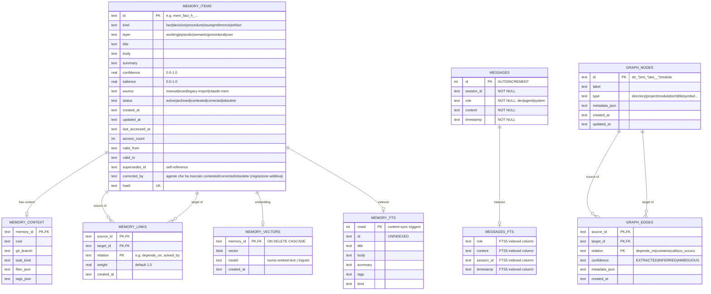

# Schema database di code-mem (state.db)

> Schema ER del file `memory/state.db` (SQLite). Fonte: [`docs/DATABASE-SCHEMA.mmd`](DATABASE-SCHEMA.mmd).
> Verificato sul DB reale con SQLite (tabelle + chiavi).

`state.db` è la **source of truth**. `graph.json`, `MEMORY.md`/`USER.md` sono proiezioni rigenerabili.

## Diagramma ER

## Note

- **FTS5 content-sync:** `MEMORY_FTS` è una virtual table legata a `MEMORY_ITEMS` con trigger; non va scritta a mano.
- **Capture layer:** `MESSAGES` è la tabella dei log conversazionali scritti da `cm save --auto [--role dev|agent]`, `cm recall-auto` e `cm watch` (vedi `src/capture.js`). `od()` chiama `ensureMessagesSearchTables` che crea la virtual table FTS5 `MESSAGES_FTS` (content=`MESSAGES`, content_rowid=`id`) più trigger `messages_ai`/`messages_ad` (INSERT/DELETE sync); in caso di FTS5 non disponibile ha un fallback a tabella reale. Lettori: `cm sq`, `cm entities --msgs`.
- **Chiavi composite:** `MEMORY_LINKS` e `GRAPH_EDGES` hanno PK su `(source, target, relation)` — il fatto che un'identificazione sia `PK,FK` riflette la PK della tabella figlia, non un vincolo FK di SQLite.
- **Self-reference:** `MEMORY_ITEMS.supersedes_id` punta a un'altra riga della stessa tabella.
- **Projection:** `graph.json` è generato da `graph_nodes`+`graph_edges`; `MEMORY.md`/`USER.md` da `memory_items` (vedi `refreshProjections`, `syncGraphProjection`).
