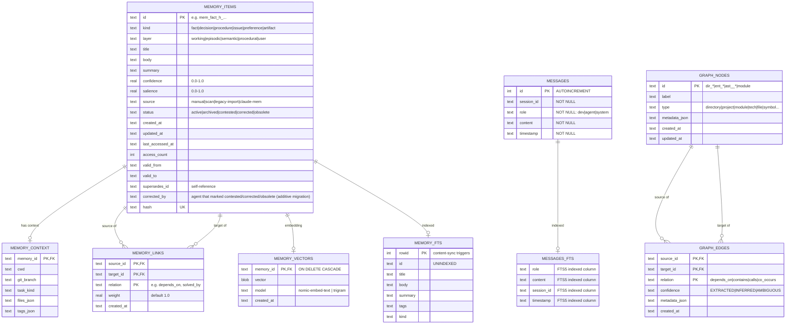

# CodeMem database schema (`state.db`)

> ER schema for `memory/state.db` (SQLite). Source: [`database-schema.mmd`](database-schema.mmd).
> Verified against the live SQLite schema (tables and keys).

`state.db` is the **source of truth**. `graph.json` and `MEMORY.md`/`USER.md` are regenerable projections.

## Entity-relationship diagram

## Notes

- **FTS5 content sync:** `MEMORY_FTS` is a trigger-maintained virtual table; do not write to it directly.
- **Capture layer:** `MESSAGES` stores rows from `cm save --auto`, `cm recall-auto` and `cm watch`. `MESSAGES_FTS` indexes them with insert/delete triggers and falls back to a real table when FTS5 is unavailable. Readers include `cm sq` and `cm entities --msgs`.
- **Composite keys:** `MEMORY_LINKS` and `GRAPH_EDGES` use `(source, target, relation)` as their primary key. `PK,FK` in the diagram describes the child key and relationship, not an extra SQLite constraint.
- **Self-reference:** `MEMORY_ITEMS.supersedes_id` points to another row in the same table.
- **Projections:** `graph.json` comes from `graph_nodes` + `graph_edges`; `MEMORY.md`/`USER.md` come from `memory_items`.
