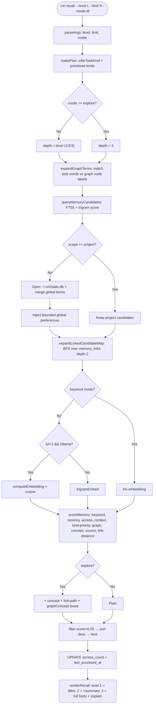

# `cm recall` flow (hybrid retrieval)

> Retrieval flow details. Source: [`recall-flow.mmd`](recall-flow.mmd).
> Code path: `bin/cm` dispatch → `src/retrieval.js` (`recallMemories()` → `scoreMemory()` → `renderRecall()`); `recall-auto`/`captureAutoRecall` live in `src/capture.js`.

Goal: find the most relevant memories for a task by combining **deterministic search, graph context and optional embeddings**, with a local fallback always available.

## Flow diagram

## Main stages

1. **Plan** — `makePlan()` classifies the task (debug, feature, refactor, review, docs or deploy) and prioritizes memory kinds.
2. **Multi-store scope** — default recall reads the project plus global `~/.cm/state.db`; global preferences are injected in a bounded slice. `--scope project` is project-only and `--scope global` is global-only.
3. **Expansion** — graph labels and BFS over `memory_links` find related memories.
4. **Optional embedding** — Ollama is used above level 2 when available; otherwise trigram similarity is used.
5. **Multi-signal score** — `scoreMemory()` combines keywords, recency, access, branch/cwd context, kind priority, graph, concepts, source and link distance. `--mode` rebalances these signals.
6. **Selection** — results below `0.05` are filtered, sorted and limited; returned rows update `access_count`.
7. **Rendering** — `--level` controls titles, summaries and full bodies with explanations.

## Multi-round temperature reranking (`recall-auto` only)

Before rendering, `cm recall-auto` applies a three-round EM-like reranking pass (`temperatureRerank()` in `src/retrieval.js`):

- round *r* applies softmax at temperature `T0/r` (`T0 = 1.0`), becoming more decisive each round;
- round probabilities accumulate into `consensus_i = Σ_r p_i(r)`;
- round one is monotonic in the base score, so ordinary `cm recall` ordering is unchanged;
- later rounds promote candidates supported by stable mixed signals and demote borderline matches;
- final scores are rescaled to `[0,1]`, with `rerankConsensus` metadata, and repeated runs are deterministic.
