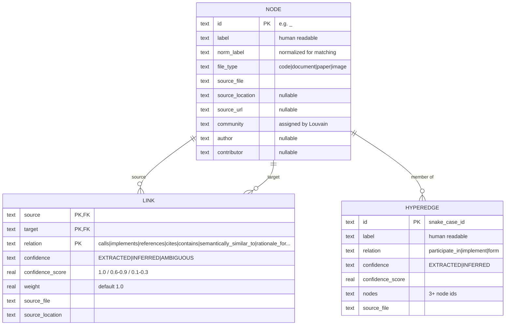
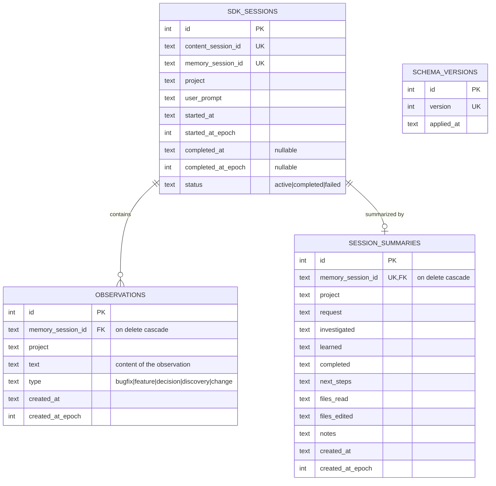

# Competitor data schemas: Graphify and claude-mem

> Schemas derived from **real local sources**: the installed Graphify output
> (`graphify-out/graph.json`) and claude-mem v9.1.1 table definitions read from
> `scripts/context-generator.cjs`.

## 1. graphify — `graphify-out/graph.json`

The actual JSON shape is importable by networkx: `{ directed, multigraph, nodes[], links[], hyperedges[] }`.
`links` stores edges; the key is not named `edges`.

> There is no relational database; `graph.json` is the persistent store. Graphify
> also keeps working files under `graphify-out/` (`.graphify_extract.json`,
> `.graphify_analysis.json`, `.graphify_labels.json`).

## 2. claude-mem — database SQLite (migration004)

Actual tables read from the code (`context-generator.cjs`): `schema_versions`, `sdk_sessions`, `observations`, `session_summaries`.

> `observations.type` reflects the MCP search workflow types
> (`bugfix|feature|decision|discovery|change`). The observation `text` and
> `type` are the durable content, linked to their originating session.
